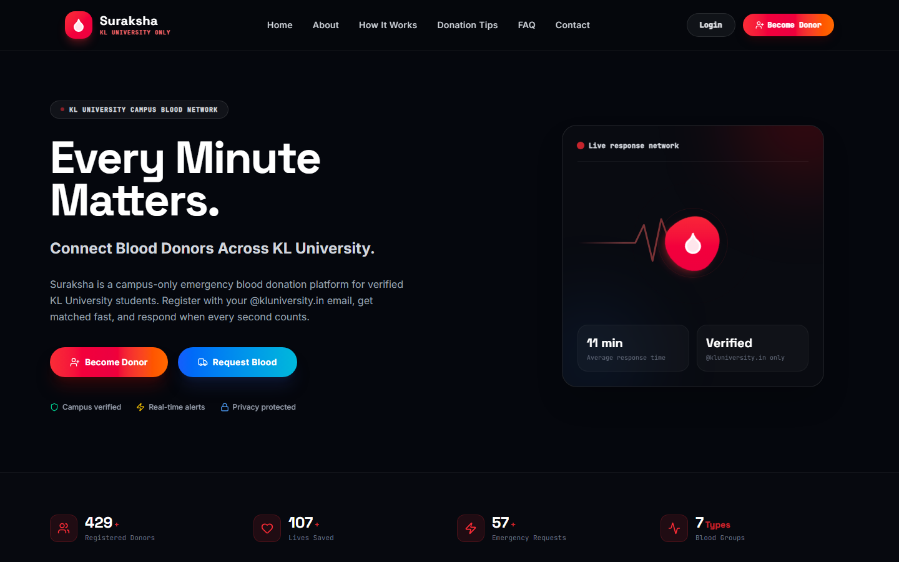
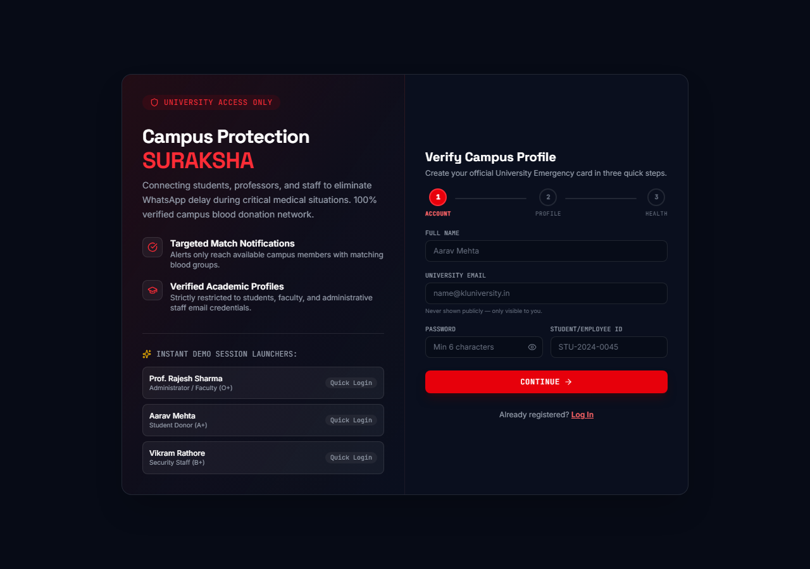
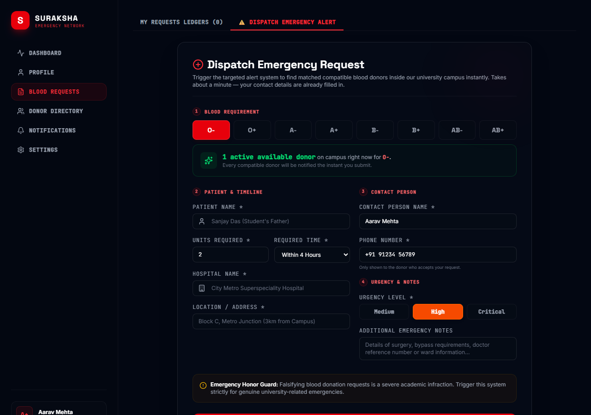
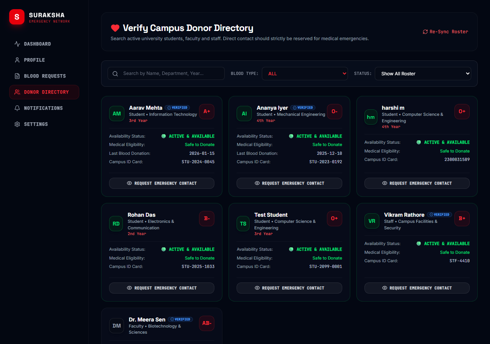
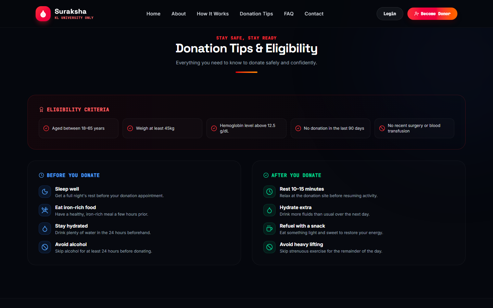

<div align="center">

# 🩸 Suraksha
### Campus Emergency Blood Network

**One Campus. One Community. Saving Lives Together.**

A campus-only emergency blood donation platform that matches and notifies a compatible, available donor within minutes — no more WhatsApp groups, no more chat spam.

[](https://react.dev/)
[](https://www.typescriptlang.org/)
[](https://vitejs.dev/)
[](https://tailwindcss.com/)
[](https://firebase.google.com/)
[](#-license)



</div>

<br />

## 📋 Table of Contents

- [Features](#-features)
- [Tech Stack](#-tech-stack)
- [Getting Started](#-getting-started)
- [Try It Out](#-try-it-out)
- [Screenshots](#-screenshots)
- [Project Structure](#-project-structure)
- [Sandbox Mode — Read Before Deploying](#️-sandbox-mode--not-production-hardened)
- [License](#-license)

<br />

## ✨ Features

| | |
|---|---|
| 🚨 **Emergency Request Dispatch** | Post a blood request with patient, hospital, and urgency details — every compatible, available donor is notified the instant you submit. |
| 🧠 **Smart Donor Matching** | A scored matching engine ranks donors by blood-group compatibility, availability, 90-day donation eligibility, department, and donation history. |
| 📇 **Donor Directory** | Search and filter the verified campus donor roster; contact details are only revealed on request, protecting donor privacy. |
| 🔔 **Real-Time Notifications** | A live floating alert lets a matched donor accept or decline a request the moment it arrives. |
| 📊 **Donor Dashboard** | Profile management, an availability toggle, donation history, prestige levels, badges, and reward points. |
| 🛡️ **Admin Console** | Verify member accounts, manage active requests, publish campus-wide announcements, and track safety analytics. |
| 📝 **3-Step Registration Wizard** | Account → Profile → Health, with a live progress indicator and inline validation. |

<br />

## 🛠 Tech Stack

<table>
<tr>
<td valign="top" width="50%">

**Frontend**
- [React 19](https://react.dev/) + [TypeScript](https://www.typescriptlang.org/)
- [Vite](https://vitejs.dev/) — dev server & build
- [Tailwind CSS v4](https://tailwindcss.com/) — styling
- [React Router](https://reactrouter.com/) — routing
- [Motion](https://motion.dev/) — animation
- [Lucide](https://lucide.dev/) — icons

</td>
<td valign="top" width="50%">

**Backend**
- [Firebase Firestore](https://firebase.google.com/docs/firestore) — real-time database
- [Firebase Auth](https://firebase.google.com/docs/auth) — imported, not yet wired in (see [Sandbox Mode](#️-sandbox-mode--not-production-hardened))

</td>
</tr>
</table>

<br />

## 🚀 Getting Started

**Prerequisites:** Node.js 18+

```bash
# 1. Install dependencies
npm install

# 2. Configure Firebase — point src/firebase.ts at your own
#    Firebase project (Firestore enabled), or use the bundled sandbox project

# 3. Run the dev server
npm run dev
```

The app runs at **http://localhost:3000**. On first load it seeds the database with sample campus users, requests, donations, and announcements if it's empty.

### Scripts

| Command | Description |
|---|---|
| `npm run dev` | Start the Vite dev server |
| `npm run build` | Production build (`vite build`) |
| `npm run preview` | Preview the production build locally |
| `npm run lint` | Type-check the project (`tsc --noEmit`) |

<br />

## 🎮 Try It Out

No need to register — the login screen has **instant demo session launchers** for three roles:

| Role | Name | Blood Group |
|---|---|---|
| 🛡️ Admin / Faculty | Prof. Rajesh Sharma | O+ |
| 🎓 Student Donor | Aarav Mehta | A+ |
| 👷 Security Staff | Vikram Rathore | B+ |

<br />

## 📸 Screenshots

<table>
<tr>
<td width="50%">
<p align="center"><b>3-Step Registration Wizard</b></p>

</td>
<td width="50%">
<p align="center"><b>Emergency Request — Live Donor Match</b></p>

</td>
</tr>
<tr>
<td width="50%">
<p align="center"><b>Donor Directory</b></p>

</td>
<td width="50%">
<p align="center"><b>Donation Tips & Eligibility</b></p>

</td>
</tr>
</table>

<br />

## 📁 Project Structure

```
src/
├── components/
│   ├── LandingPage.tsx           Public marketing homepage
│   ├── AuthModal.tsx             Login / 3-step registration wizard
│   ├── Dashboard.tsx             Donor dashboard shell
│   ├── RequestPortal.tsx         Emergency blood request form
│   ├── DonorDirectory.tsx        Searchable donor roster
│   ├── SmartMatchingPanel.tsx    Scored donor-matching engine UI
│   ├── RealTimeNotifications.tsx Live floating match alert
│   └── AdminPanel.tsx            Admin console
├── utils/seeder.ts               First-run sample data seeding
├── firebase.ts                   Firebase app/Firestore/Auth init
└── types.ts                      Shared TypeScript types
```

<br />

## ⚠️ Sandbox Mode — Not Production-Hardened

> This project currently runs in a **demo/sandbox authentication mode**, not real Firebase Auth. Before deploying for real campus use:

- 🔓 Login/registration compares a plaintext `_sandboxPassword` field stored on the Firestore user document — passwords are **not hashed**.
- 🔓 `firestore.rules` currently allows unrestricted read/write (`allow read, write: if true`) to keep the demo frictionless.

Replace the sandbox auth flow with real Firebase Authentication and lock down `firestore.rules` to per-user access rules before going live.


<div align="center">

Built for the KL University campus community 🩸

</div>
